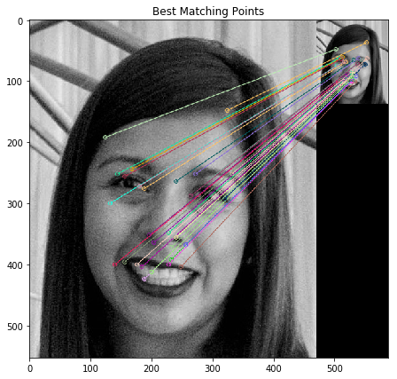
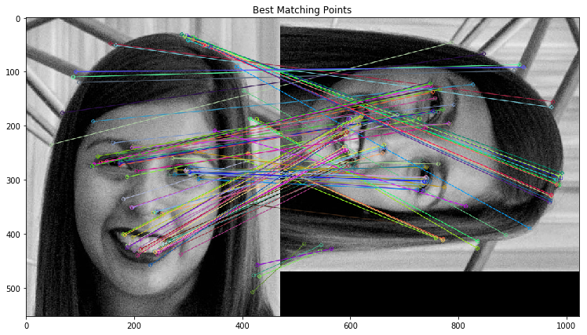
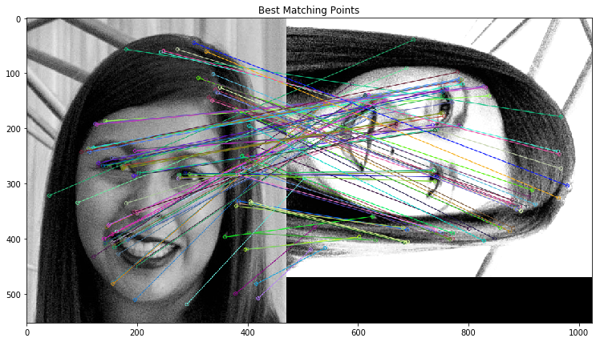
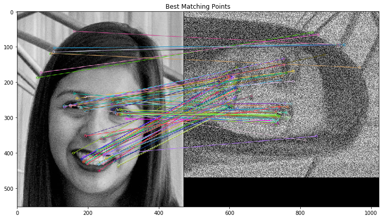

 
In order to see the properties of the ORB algorithm more clearly, 
in the following examples we will use the same image as our training and query image.

## Fast Local Feature Detector ORB

Oriented FAST and rotated BRIEF (ORB) is a fast robust local feature detector, 
first presented by Ethan Rublee et al. in 2011

The algorithm ORB can be efficient alternative for well-known descriptors SIFT and SURF.
The algorithm has the good invariant properties, it robust with respect to
scaling, rotation, noising, illuminations, and also the case where the image
contains several faces. 

Three Python files shows that alogorithm ORB obtains true keypoints even for 
rotated, noised images, or for image containing several faces.

## OpenCV Methods

The following cv2 methods are used:
  * ORB_create,
  * detectAndCompute
  * BFMatcher (Brute-Force Matcher)
  
## Images 
The input files are in the subdirectory 'images'.
The metod drawMatches connects the keypoints in the training image 
with their best matching keypoints in the query image,
the result images are in the subdirectory 'match_keypoints'.

## ORB Invariance Properties
We explore each of the main properties of the ORB algorithm:

 * Scale Invariance
 * Rotational Invariance
 * Illumination Invariance
 * Noise Invariance

 ORB_alg_part3_ScaleInv
   * get keypoints for the image face.jpeg and its rotated case faceQS.jpeg     
   * Connect the keypoints in the training image with their best matching keypoints
     in the query image. The best matches correspond to the first elements 
     in the sorted matches list, since they are the ones with the shorter distance
   * compare obtained keypoints, see the result image:
   
   
        
 ORB_alg_part4_RotateInv.py 
   * get keypoints for the image face.jpeg and its rotated case faceR.jpeg       
   * compare obtained keypoints, see the result image:
   
   
      
 ORB_alg_part5_IllumInv.py  
   * get keypoints for the image face.jpeg and its illumination-distorted case faceRI.jpeg 
   * compare obtained keypoints, see the following image:
   
   
   
    
 ORB_alg_part6_NoiseInv.py
   * get keypoints for the image face.jpeg and its rotated and noised case faceRN5.jpeg       
   * compare obtained keypoints here:
   
   
   
 ORB_alg_part7_ObjectDet.py 
   * find the face in the image Team.jpeg
   * gets keypoints for the image face.jpeg and its mapping in faceRN5.jpeg       
   * compare obtained keypoints: 
   
   
      
## Used OpenCV and related functions

* cv2.imread
* cv2cvtColor
* cv2.ORB_create,  
  orb.detectAndCompute
* cv2.BFMatch,      
  bf.match
* cv2.drawMatches
 

 

