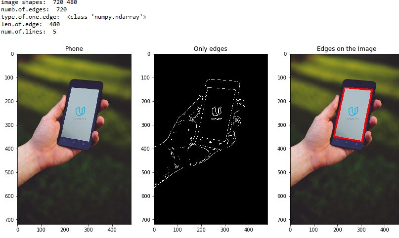
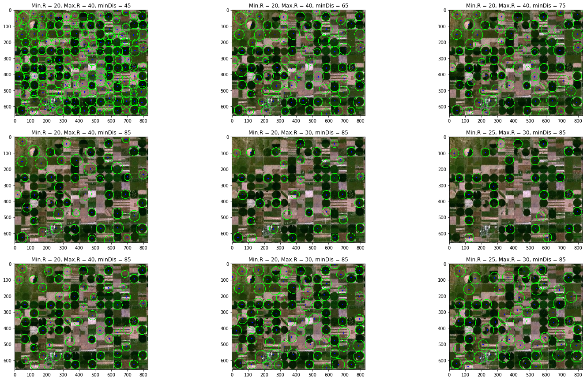

## About Hough transform

The classical Hough transform was concerned with the identification of lines in the image,
but later the Hough transform has been extended to identifying positions of arbitrary shapes,
most commonly circles or ellipses. The Hough transform as it is universally used today 
was invented by Richard Duda and Peter Hart in 1972, who called it a "generalized Hough transform" 
after the related 1962 patent of Paul Hough (Method and means for recognizing complex patterns, 
U.S. Patent 3,069,654, Dec. 18, 1962)

## Identification of Lines 
Hough_lines.py is designed to
  * get all edges in the image (currently phone.jpg)
        uses cv2.Canny
  * get all lines having not less than 'min_line_len' edges
        uses cv2.HoughLinesP

In the result image

we see edges in the middle image and red lines selecting the phone screen.    

## Identification of Circles
Hough_circles.py is designed to
   * get possible circles in the image (round_farms.jpg)
        uses cv2.GaussianBlur and cv2.HoughCircles
The input parameters of function HoughCircle we get
different set of circles, see the following image:

## Used OpenCV and related functions

* cv2.imread
* cv2cvtColor
* cv2.Canny  
* cv2.HoughLinesP,      
* cv2.HoughCircles
* cv2.GaussianBlur
* cv2.line
* cv2.circle
