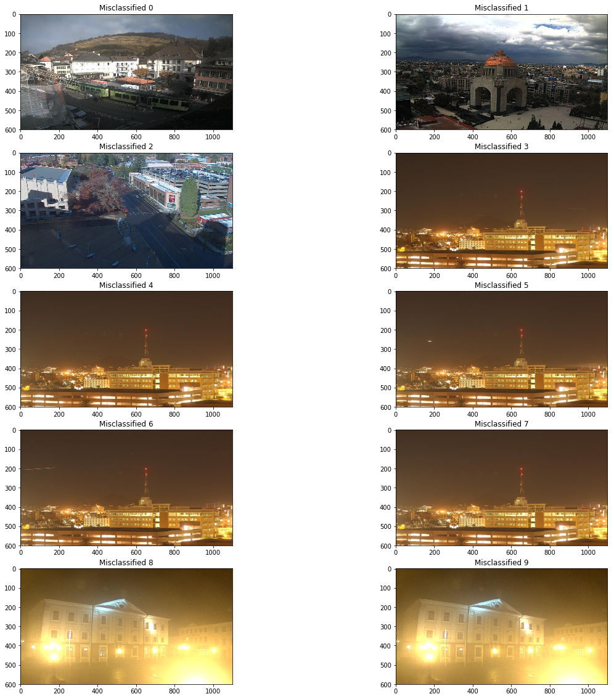

## Training and Testing Data
The 288 day/night images are separated into training and testing datasets.

160 of these images are training images to create a classifier.
128 are test images, which will be used to test the accuracy of classifier. 

## Feature Extraction
Create a feature that represents the brightness in an image. 
We extract the average brightness using HSV colorspace.
Specifically, we use the V channel (a measure of brightness),
add up the pixel values in the V channel, then divide that sum 
by the area of the image to get the average Value of the image.

Find the average brightness using the V channel
This function takes in a standardized RGB image and returns
a feature (a single value) that represent the average level of 
brightness in the image. We'll use this value to classify
the image as day or night.

## Day Night Image Classifier
 * DayNight_HSV_AbgBr.py
   1. Display HSV channels for one day image.
   2. Testing average brightness levels.
   
   
   On the image above we see H-S-V channels and the example of a night image with average of brightness = 36.18.

 * DayNight_Blue_Thresholds.py 
   1. Day Night Threshold.
   2. Blue channel Threshold.
   
   We get Day averageg Brightness:  140.96  and Night average brightness:   62.77.
In the Blue channel Day Blue-average brightness: 130.96, and  Night Blue-average brightness channel:   36.90   

 * DayNaight_Classifier.py
   1. Classify day and night images.
   2. Visualize the misclassified images.
 From 128 images 10 are missclssified:
 
 
 
 * DayNight_ImprovedClassifier.py  
   1. Classify day and night images.
   2. Visualize the misclassified images.
   3. The number of images are missclasiffied (10 from 128). 
   4. With additional criterion 9 from 10 are reclassified.
