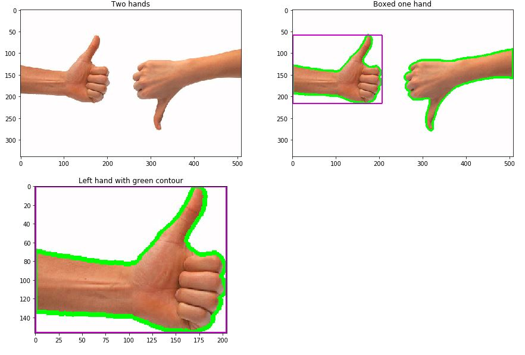

## Detect edges and contous

ImageContours.py  uses the function 'findContours' and 'fitEllipse' from OpenCV 
to find the contour of the left hand in the image (thumbs_up_down.jpg).  
As the algorithm  Hough_phone.py (see the subproject 'Agorithm-HoughTransform' 
in this repository) the function 'findContours' finds all edges and then turns out
them into different contours.   

## Get only long contours

Further, we use the function 'threshold' from OpenCV.
If to choose the minimal value of the threshold = 250 (instead 240) we get 
many short (about 219) counters . In order to find only long contours we get 
contours  with len(contours[i]) > 50. Now, we get only 2 very long contours:
left and right hands.

## Find contour orientation

The function 'fitEllipse' returns the angle of the main orientation of every contour.
The function 'orientations' returns all angles for all contours. 
The left hand has the greater angle, so the get:
  the contour #0 with angle about 61 degrees
  the contour #1 with angle about 83 degrees

Thus, the suitable contour the contour #1.
The suitable contour (related to the left hand) is boxed by the function 'rectangle'.

Finally, we get the left hand with contour: 
  
