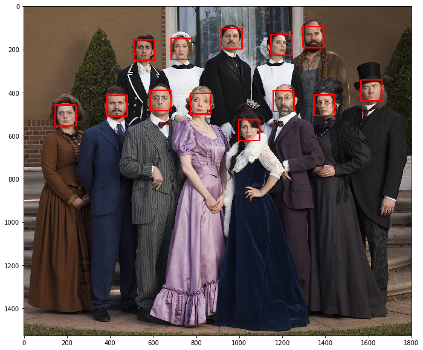

## AdaBoost face detector

AdaBoost frontal face detector (short for Adaptive Boosting) is a machine learning 
meta-algorithm formulated  by Yoav Freund and Robert Schapire, who won the 2003 Gödel Prize
for their work "A decision-theoretic generalization of on-line learning 
and an application to boosting" (1997). Viola and Jones introduced
in "Rapid Object Detection Using a Boosted Cascade of Simple Features" (2001)
a technique for speeding up processing of boosted classifiers testing each potential object 
with as many layers of the final classifier speeding up computation for cases where the class 
of the object can easily be determined (here, this is face detector).  

## Input image
The input image  multi_faces.jpg contains 13 faces: 

## Haarcascade detector

Directory _detector_architectures_ contains
haarcascade_frontalface_default.xml  --
This is the stump-based 24x24 discrete adaboost frontal face detector.

## A note on parameters

How many faces are detected is determined by the function,
 `detectMultiScale` which aims to detect faces of varying sizes. 
 The inputs to this function are: _(image, scaleFactor, minNeighbors)_;
 We often detect more faces with a smaller scaleFactor, 
 and lower value for minNeighbors,
 but raising these values often produces better matches.

## OpenCV funstions 

Haar_cascades_classif.py

  * uses AdaBoost face detector 
       haarcascade_frontalface_default.xml, 
	   cv2.CascadeClassifier
	   
  * draws detected faces as a red rectangle 	   
	   cv2.rectangle
	    
## Result image 
	    

All faces were found in the resulting image and are highlighted in red: 

